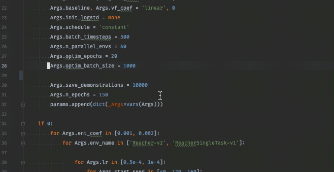
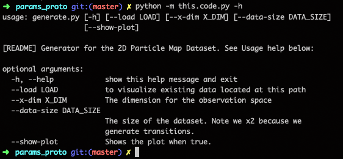

# `params-proto`, A Python Decorator That Gives Your Model Parameters Super-power

- 2019/06/11: Now supports `tab-completion` at the command line!
- 2018/11/08: Now supports both python `3.52` as well as `3.6`! :bangbang::star:

## What is "Experiment Parameter Hell"?

"Experiemnt Parameter Hell" occurs when you have more than twenty parameters for your ML project that are all defined as string/function parameters with `click` or `argparse`. Sometimes these parameters are defined in a launch script and passes through five layers of function calls during an experiment.

</img>

Your Python IDEs work very hard on static code analysis to intelligently make you more productive, and the "parameter hell" breaks all of that.

In your ML project, you want to avoid using dictionaries or opaque argparse definitions as much as you can. You want to write those parameters **declaratively** instead. This way, your IDE can actually help you navigate through those layers of function calls.

## Writing documentation as uhm..., man page?
</img>
`Params-Proto` exposes your argument namespace's doc string as the usage note. For users of your code, there is no better help than the one that comes with the script itself!

> With `params-proto`, your help is only one `-h` away :)

And **Your code becomes the documentation.**

## Why Use Params_Proto Instead of Click or Argparse?

**Because this is declarative**, which makes it easy to refactor your code and find variable references.

- You want to place all of the arguments under a namespace that can be statically checked.
- This allows your IDE to:
    1. Find usage of each argument
    2. jump from *anywhere* in your code base to the declaration of that argument
    3. refactor your argument name **in the entire code base** automatically

`Params_proto` is the declarative way to write command line arguments, and is the way to go for ML projects.

## Tab-completion for your script!

`params_proto` uses `argparse` together with `argcomplete`, which enables command line autocomplete on tabs! To enable run

```python
pip install params-proto
# then:
activate-global-python-argcomplete
```

For details, see [`argcomplete`'s documentation](https://github.com/kislyuk/argcomplete#installation).

## Simple Example (with batteries included!!):battery:

```python
# this.code.py
from params_proto import cli_parse, BoolFlag, Proto

@cli_parse
class Args:
    """
    [README]
        Generator for the 2D Particle Map Dataset. See Usage help below:
    """
    load = Proto(None, dtype=str, help="to visualize existing data located at this path")
    x_dim = Proto(2, help="The dimension for the observation space")
    data_size = Proto(20, help="The size of the dataset. Note we x2 because we generate transitions.")
    show_plot = BoolFlag(True, help="Shows the plot when true.")

def train():
    D = Discriminator(Args.x_dim)

def launch(**kwargs):
    Args.update(kwargs)

if __name__ == "__main__":
    launch(show_plot=True)
```


now, if you run this code, it gives you this help in the command line:
```python
(/Users/ge/anaconda/envs/some-project) ➜ git:(master) python -m this.code.py -h
usage: generate.py [-h] [--load LOAD] [--x-dim X_DIM] [--data-size DATA_SIZE]
                   [--show-plot]

[README] Generator for the 2D Particle Map Dataset. See Usage help below:

optional arguments:
  -h, --help            show this help message and exit
  --load LOAD           to visualize existing data located at this path
  --x-dim X_DIM         The dimension for the observation space
  --data-size DATA_SIZE
                        The size of the dataset. Note we x2 because we
                        generate transitions.
  --show-plot           Shows the plot when true.
```

Now, isn't this awesome? :bang::stars:

## How to override when calling from python

It is very easy to over-ride the parameters when you call your function: have most of your training code **directly** reference the parser namespace (your configuration namespace really), and just monkey patch the attribute.

`params-proto` works very well with the clound ML launch tool [jaynes](https://github.com/episodeyang/jaynes). Take a look at the automagic awesomeness of [jaynes](https://github.com/episodeyang/jaynes):)

## Todo

### Done
- [x] publish
- [x] add test
- [x] add `python3.52` test on top of `python3.6` test.

## Installation
```bash
pip install params-proto
```

## Usage

### To use a python namespace to declare commandline argments

**Updated** We now use a `Proto` helper function to declare the argparse arguments! See example below:

## Simple example showing how to use python namespace to declare command line arguments:

**note**: for boolean, use `bool` or `"bool"`. `params_proto` will automatically use `distutils.util.strtobool` to parse it into `bool`. Details look [here](https://docs.python.org/2/distutils/apiref.html?highlight=distutils.util#distutils.util.strtobool)

```python
from .params_proto import cli_parse, is_hidden, Proto, ParamsProto, proto_signature


def test_cli_proto():
    @cli_parse
    class G(ParamsProto):
        """Supervised MAML in tensorflow"""
        npts = Proto(100, help="number of points to sample from distribution")
        num_epochs = Proto(70000, help="number of epochs to train")
        num_tasks = Proto(10, help="number of tasks in the inner loop")
        num_grad_steps = Proto(1, help="number of gradient descent steps in the inner loop")
        num_points_sampled = Proto(10, help="effectively the k-shot")
        eval_grad_steps = Proto([0, 1, 10], type=bool, help="the grad steps evaluated with full sample")
        fix_amp = Proto(False, help="controls the sampling, fix the amplitude of the sample distribution if True")

    assert G.npts == 100
    G.npts = 10
    assert G.npts == 10
    assert vars(G) == {'npts': 10, 'num_epochs': 70000, 'num_tasks': 10, 'num_grad_steps': 1,
                       'num_points_sampled': 10, 'fix_amp': False,
                       'eval_grad_steps': [0, 1, 10]}
    assert G._proto is not None, '_proto should exist'
```

### Setting Function Signatures using Python Namespace

sometimes, you have a function with wildcard keyword argument signature. It is
annoying to work with such functions because the static type analysis of the
IDE doesn't tell you what needs to go in.

I originally wrote this decorator to help with that case, however the dynamically
set function signature won't show up in the IDE in general. Use this for inspection
purposes if you like.

Below si the usage example and the test case:

```python
def test_proto_signature():
    @cli_parse
    class G(ParamsProto):
        """some parameter proto"""
        n = 1
        npts = Proto(100, help="number of points to sample from distribution")
        ok = True

    @proto_signature(G._proto)
    def main_demo(**kwargs):
        print('npts = ', kwargs['npts'])
        return kwargs['npts']

    # First way is to use proto_signature decorator. The dynamically generated signature
    # however does not show up in pyCharm. It does however, show during run time.
    import inspect

    assert main_demo(npts=10) == 10
    print("main_demo<Function> signature:", inspect.signature(main_demo))
    assert str(inspect.signature(main_demo)) == "(n=1, npts=100, ok=True)"
```

## To Develop

```bash
git clone https://github.com/episodeyang/params_proto.git
cd params_proto
make dev
```

To test, run the following under both python `3.52` and `3.6`.
```bash
make test
```

This `make dev` command should build the wheel and install it in your current python environment. Take a look at the [./Makefile](./Makefile) for details.

**To publish**, first update the version number, then do:
```bash
make publish
```
